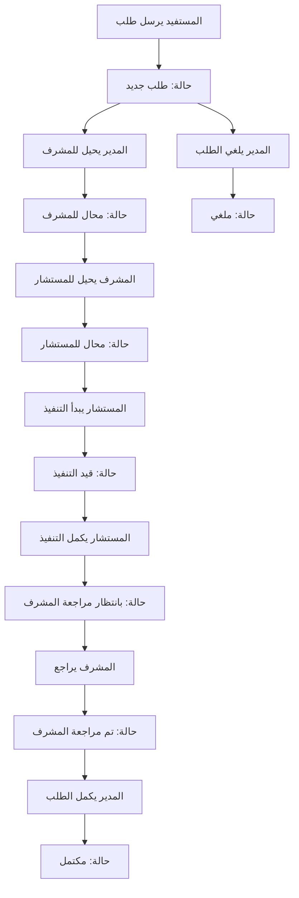

# وثائق API نظام إصلاح ذات البين (Reconcile Request System)

## نظرة عامة على النظام

نظام إصلاح ذات البين هو نظام إدارة شامل لمعالجة طلبات إصلاح ذات البين من خلال تدفق عمل منظم يتضمن عدة أدوار ومراحل.

### الأدوار في النظام
- **المستفيد (Requester)**: يقوم بإرسال الطلب (لا يحتاج تسجيل دخول)
- **المشرف (Supervisor)**: يدير ويراجع الطلبات
- **المستشار (Mediation)**: يقوم بتنفيذ الاستشارة
- **المدير (Admin)**: يدير النظام كاملاً

---

## تدفق عملية إصلاح ذات البين



### حالات الطلب
1. **NewRequest (0)**: طلب جديد
2. **AssignedToSupervisor (1)**: محال إلى مشرف
3. **AssignedToMediation (2)**: محال إلى مستشار
4. **InProgress (3)**: قيد التنفيذ
5. **PendingSupervisorReview (4)**: بانتظار مراجعة المشرف
6. **SupervisorReviewed (5)**: تم مراجعة المشرف
7. **Completed (6)**: مكتمل
8. **Cancelled (7)**: ملغي

---

## 1. إدارة أنواع الاستشارات (ReconcileRequestType)

### 1.1 الحصول على جميع الأنواع
```http
GET /api/reconcilerequesttype
```

**الصلاحيات**: عام (لا يحتاج تسجيل دخول)
**الاستجابة**:
```json
{
  "success": true,
  "message": "Success",
  "data": [
    {
      "id": 1,
      "name": "استشارة أسرية",
      "description": "استشارة تتعلق بالمشاكل الأسرية",
      "isActive": true
    }
  ]
}
```

### 1.2 الحصول على الأنواع النشطة
```http
GET /api/reconcilerequesttype/active
```

**الصلاحيات**: عام
**الاستجابة**: نفس الاستجابة أعلاه ولكن فقط الأنواع النشطة

### 1.3 الحصول على نوع محدد
```http
GET /api/reconcilerequesttype/{id}
```

**الصلاحيات**: عام
**المعاملات**: `id` (رقم النوع)
**الاستجابة**: كائن واحد من النوع

### 1.4 إنشاء نوع جديد
```http
POST /api/reconcilerequesttype
Authorization: Bearer {token}
```

**الصلاحيات**: Admin
**الطلب**:
```json
{
  "name": "استشارة نفسية",
  "description": "استشارة تتعلق بالمشاكل النفسية"
}
```

### 1.5 تحديث نوع
```http
PUT /api/reconcilerequesttype/{id}
Authorization: Bearer {token}
```

**الصلاحيات**: Admin
**الطلب**:
```json
{
  "name": "استشارة نفسية محدثة",
  "description": "وصف محدث"
}
```

### 1.6 حذف نوع
```http
DELETE /api/reconcilerequesttype/{id}
Authorization: Bearer {token}
```

**الصلاحيات**: Admin

### 1.7 تفعيل/إلغاء تفعيل نوع
```http
PUT /api/reconcilerequesttype/{id}/toggle-active
Authorization: Bearer {token}
```

**الصلاحيات**: Admin

---

## 2. إدارة طلبات إصلاح ذات البين (ReconcileRequest)

### 2.1 إرسال طلب جديد
```http
POST /api/reconcilerequest
Content-Type: multipart/form-data
```

**الصلاحيات**: عام (لا يحتاج تسجيل دخول)
**الطلب** (Form Data):
```
Name: أحمد محمد
Email: ahmed@example.com
PhoneNumber: 0501234567
RequestText: تفاصيل الطلب...
ReconcileRequestTypeId: 1
Attachments: [files] (اختياري)
```

**الاستجابة**:
```json
{
  "success": true,
  "message": "تم إرسال الطلب بنجاح",
  "data": {
    "id": 123,
    "name": "أحمد محمد",
    "email": "ahmed@example.com",
    "phoneNumber": "0501234567",
    "requestText": "تفاصيل الطلب...",
    "reconcileRequestTypeId": 1,
    "status": 0,
    "createdAt": "2024-01-01T10:00:00Z",
    "attachments": []
  }
}
```

### 2.2 الحصول على جميع الطلبات (Admin)
```http
GET /api/reconcilerequest
Authorization: Bearer {token}
```

**الصلاحيات**: Admin
**الاستجابة**: مصفوفة من جميع الطلبات

### 2.3 الحصول على طلب محدد
```http
GET /api/reconcilerequest/{id}
Authorization: Bearer {token}
```

**الصلاحيات**: Admin, Supervisor, Mediation
**المعاملات**: `id` (رقم الطلب)

### 2.4 حذف طلب
```http
DELETE /api/reconcilerequest/{id}
Authorization: Bearer {token}
```

**الصلاحيات**: Admin

---

## 3. عمليات المدير (Admin Operations)

### 3.1 إحالة طلب لمشرف
```http
POST /api/reconcilerequest/{id}/assign-supervisor
Authorization: Bearer {token}
```

**الصلاحيات**: Admin
**الطلب**:
```json
{
  "supervisorId": 5
}
```

**الاستجابة**: الطلب المحدث مع تغيير الحالة إلى `AssignedToSupervisor`

### 3.2 إلغاء طلب
```http
POST /api/reconcilerequest/{id}/cancel
Authorization: Bearer {token}
```

**الصلاحيات**: Admin
**الاستجابة**: الطلب مع تغيير الحالة إلى `Cancelled`

### 3.3 إكمال طلب نهائياً
```http
POST /api/reconcilerequest/{id}/complete
Authorization: Bearer {token}
```

**الصلاحيات**: Admin
**الشرط**: يجب أن يكون الطلب في حالة `SupervisorReviewed`
**الاستجابة**: الطلب مع تغيير الحالة إلى `Completed`

---

## 4. عمليات المشرف (Supervisor Operations)

### 4.1 الحصول على طلبات المشرف
```http
GET /api/reconcilerequest/supervisor/{supervisorId}
Authorization: Bearer {token}
```

**الصلاحيات**: Admin, Supervisor
**المعاملات**: `supervisorId` (رقم المشرف)

### 4.2 إحالة طلب لمستشار
```http
POST /api/reconcilerequest/{id}/assign-mediation
Authorization: Bearer {token}
```

**الصلاحيات**: Supervisor
**الطلب**:
```json
{
  "mediationId": 10
}
```

**الاستجابة**: الطلب مع تغيير الحالة إلى `AssignedToMediation`

### 4.3 مراجعة طلب مكتمل
```http
POST /api/reconcilerequest/{id}/mark-reviewed
Authorization: Bearer {token}
```

**الصلاحيات**: Supervisor
**الشرط**: يجب أن يكون الطلب في حالة `PendingSupervisorReview`
**الاستجابة**: الطلب مع تغيير الحالة إلى `SupervisorReviewed`

---

## 5. عمليات المستشار (Mediation Operations)

### 5.1 الحصول على طلبات المستشار
```http
GET /api/reconcilerequest/mediation/{mediationId}
Authorization: Bearer {token}
```

**الصلاحيات**: Admin, Mediation
**المعاملات**: `mediationId` (رقم المستشار)

### 5.2 بدء تنفيذ طلب
```http
POST /api/reconcilerequest/{id}/start
Authorization: Bearer {token}
```

**الصلاحيات**: Mediation
**الطلب**:
```json
{
  "consultantNotes": "ملاحظات المستشار"
}
```

**الاستجابة**: الطلب مع تغيير الحالة إلى `InProgress`

### 5.3 إكمال تنفيذ طلب
```http
POST /api/reconcilerequest/{id}/complete-execution
Authorization: Bearer {token}
```

**الصلاحيات**: Mediation
**الطلب**:
```json
{
  "consultantNotes": "ملاحظات إضافية"
}
```

**الاستجابة**: الطلب مع تغيير الحالة إلى `PendingSupervisorReview`

### 5.4 إرسال رسالة SMS
```http
POST /api/reconcilerequest/{id}/send-sms
Authorization: Bearer {token}
```

**الصلاحيات**: Mediation
**الطلب**:
```json
{
  "message": "نص الرسالة هنا"
}
```

**الاستجابة**:
```json
{
  "success": true,
  "message": "تم إرسال الرسالة بنجاح",
  "data": true
}
```

### 5.5 الحصول على نماذج الرسائل
```http
GET /api/reconcilerequest/sms-templates
Authorization: Bearer {token}
```

**الصلاحيات**: Mediation
**الاستجابة**:
```json
{
  "success": true,
  "message": "تم جلب نماذج الرسائل بنجاح",
  "data": [
    "طلب الاستشارة قيد التنفيذ، وسيتم التواصل معكم خلال الفترة القريبة القادمة.",
    "تم استلام طلب الاستشارة الخاص بكم، وسيتم التواصل معكم في أقرب وقت ممكن. شكرًا لثقتكم بنا.",
    "نود إفادتكم بأنه جارٍ العمل على طلبكم، وسيتم التواصل معكم قريبًا بإذن الله."
  ]
}
```

---

## 6. إدارة المشرفين (Supervisors)

### 6.1 الحصول على جميع المشرفين
```http
GET /api/supervisor?year=2024
Authorization: Bearer {token}
```

**الصلاحيات**: Admin
**المعاملات**: `year` (اختياري - لفلترة حسب السنة)

### 6.2 الحصول على مشرف محدد
```http
GET /api/supervisor/{id}?year=2024
Authorization: Bearer {token}
```

**الصلاحيات**: Admin
**المعاملات**: `year` (اختياري)

### 6.3 الحصول على مشرف حسب UserId
```http
GET /api/supervisor/user/{userId}
Authorization: Bearer {token}
```

**الصلاحيات**: Admin

### 6.4 إنشاء مشرف جديد
```http
POST /api/supervisor
Authorization: Bearer {token}
```

**الصلاحيات**: Admin
**الطلب**:
```json
{
  "fullName": "محمد أحمد",
  "specialty": "استشاري أسري",
  "phoneNumber": "0501234567",
  "email": "mohamed@example.com",
  "password": "Password123!",
  "confirmPassword": "Password123!"
}
```

### 6.5 تحديث مشرف
```http
PUT /api/supervisor/{id}
Authorization: Bearer {token}
```

**الصلاحيات**: Admin
**الطلب**:
```json
{
  "fullName": "محمد أحمد المحدث",
  "specialty": "استشاري أسري ونفسي",
  "phoneNumber": "0501234567"
}
```

### 6.6 حذف مشرف
```http
DELETE /api/supervisor/{id}
Authorization: Bearer {token}
```

**الصلاحيات**: Admin

### 6.7 تفعيل/إلغاء تفعيل مشرف
```http
PUT /api/supervisor/{id}/toggle-active
Authorization: Bearer {token}
```

**الصلاحيات**: Admin

---

## 7. إدارة المستشارين (Mediations)

### 7.1 الحصول على جميع المستشارين
```http
GET /api/mediation?year=2024
```

**الصلاحيات**: عام
**المعاملات**: `year` (اختياري)

### 7.2 الحصول على مستشار محدد
```http
GET /api/mediation/{id}?year=2024
```

**الصلاحيات**: عام
**المعاملات**: `year` (اختياري)

### 7.3 إنشاء مستشار جديد
```http
POST /api/mediation
Content-Type: multipart/form-data
```

**الصلاحيات**: عام (غير محمي حالياً)
**الطلب** (Form Data):
```
FullName: سارة أحمد
Specialty: استشارية نفسية
PhoneNumber: 0501234567
Email: sara@example.com
Password: Password123!
ConfirmPassword: Password123!
Image: [file] (اختياري)
```

### 7.4 تحديث مستشار
```http
PUT /api/mediation/{id}
Content-Type: multipart/form-data
```

**الصلاحيات**: عام (غير محمي حالياً)

### 7.5 حذف مستشار
```http
DELETE /api/mediation/{id}
```

**الصلاحيات**: عام (غير محمي حالياً)

---

## 8. هيكل البيانات

### 8.1 ReconcileRequestDTO
```json
{
  "id": 123,
  "name": "أحمد محمد",
  "email": "ahmed@example.com",
  "phoneNumber": "0501234567",
  "requestText": "تفاصيل الطلب",
  "reconcileRequestTypeId": 1,
  "reconcileRequestTypeName": "استشارة أسرية",
  "status": 1,
  "statusName": "محال إلى مشرف",
  "supervisorId": 5,
  "supervisorName": "محمد أحمد",
  "mediationId": 10,
  "mediationName": "سارة أحمد",
  "consultantNotes": "ملاحظات المستشار",
  "createdAt": "2024-01-01T10:00:00Z",
  "updatedAt": "2024-01-01T12:00:00Z",
  "assignedToSupervisorAt": "2024-01-01T11:00:00Z",
  "assignedToMediationAt": "2024-01-01T11:30:00Z",
  "startedAt": "2024-01-01T12:00:00Z",
  "completedAt": "2024-01-01T15:00:00Z",
  "attachments": [
    {
      "id": 1,
      "fileName": "document.pdf",
      "fileType": "pdf",
      "fileSize": 2048576,
      "uploadedAt": "2024-01-01T10:00:00Z"
    }
  ]
}
```

### 8.2 SupervisorDTO
```json
{
  "id": 5,
  "userId": "user-guid",
  "fullName": "محمد أحمد",
  "specialty": "استشاري أسري",
  "phoneNumber": "0501234567",
  "email": "mohamed@example.com",
  "isActive": true,
  "createdAt": "2024-01-01T09:00:00Z",
  "updatedAt": "2024-01-01T09:00:00Z",
  "completedRequestsCount": 15,
  "inProgressRequestsCount": 3
}
```

### 8.3 MediationDTO
```json
{
  "id": 10,
  "userId": "user-guid",
  "fullName": "سارة أحمد",
  "specialty": "استشارية نفسية",
  "imageUrl": "https://example.com/images/sara.jpg",
  "isActive": true,
  "isAvailable": true,
  "createdAt": "2024-01-01T09:00:00Z",
  "phoneNumber": "0501234567",
  "email": "sara@example.com",
  "totalRequests": 25,
  "completedRequests": 20,
  "inProgressRequests": 2,
  "completedInYear": 18
}
```

---

## 9. رموز الاستجابة والأخطاء

### 9.1 رموز النجاح
- **200**: نجح الطلب
- **201**: تم إنشاء المورد بنجاح

### 9.2 رموز الأخطاء
- **400**: طلب خاطئ (بيانات غير صحيحة)
- **401**: غير مصرح (مشكلة في التوكين)
- **403**: محظور (صلاحيات غير كافية)
- **404**: المورد غير موجود
- **500**: خطأ داخلي في الخادم

### 9.3 هيكل استجابة API
```json
{
  "success": true|false,
  "message": "رسالة الاستجابة",
  "data": { ... } | null,
  "statusCode": 200,
  "errors": ["قائمة الأخطاء"] // فقط في حالة وجود أخطاء
}
```

---

## 10. إعدادات SMS

### 10.1 إعدادات appsettings.json
```json
{
  "SMS": {
    "Provider": "Mock", // Mock, Twilio, Mobily, Gateway
    "Twilio": {
      "AccountSid": "",
      "AuthToken": "",
      "FromNumber": ""
    },
    "Mobily": {
      "ApiKey": "",
      "Sender": ""
    },
    "Gateway": {
      "ApiUrl": "",
      "ApiKey": "",
      "Sender": ""
    }
  }
}
```

### 10.2 نماذج الرسائل الجاهزة
1. "طلب الاستشارة قيد التنفيذ، وسيتم التواصل معكم خلال الفترة القريبة القادمة."
2. "تم استلام طلب الاستشارة الخاص بكم، وسيتم التواصل معكم في أقرب وقت ممكن. شكرًا لثقتكم بنا."
3. "نود إفادتكم بأنه جارٍ العمل على طلبكم، وسيتم التواصل معكم قريبًا بإذن الله."
4. "نفيدكم باستلام طلب الاستشارة، وسيتم التواصل معكم خلال أقرب وقت ممكن."
5. "تم استلام طلبكم، وسيتم التواصل معكم خلال 24 ساعة عمل بإذن الله."

---

## 11. ملاحظات مهمة

### 11.1 الأمان
- جميع endpoints محمية بـ JWT Token (باستثناء إرسال الطلب الجديد)
- التحقق من الأدوار يتم في كل endpoint
- تشفير كلمات المرور باستخدام ASP.NET Identity

### 11.2 المرفقات
- دعم رفع الملفات (صور و PDF)
- الحد الأقصى للحجم: 50 ميجابايت لكل ملف
- التخزين على الخادم في مجلدات منفصلة

### 11.3 التنبيهات
- إرسال تنبيهات للمستخدمين عند تغيير حالة الطلبات
- إرسال إشعارات بريد إلكتروني للمدراء عند الطلبات الجديدة

### 11.4 الإحصائيات
- تتبع عدد الطلبات المكتملة والقيد التنفيذ لكل مشرف ومستشار
- إمكانية الفلترة حسب السنة

---

## 12. أمثلة على الاستخدام

### 12.1 سيناريو كامل لمعالجة طلب

1. **المستفيد يرسل طلب**
```http
POST /api/reconcilerequest
// Form data with attachments
```

2. **المدير يحيل للمشرف**
```http
POST /api/reconcilerequest/123/assign-supervisor
{
  "supervisorId": 5
}
```

3. **المشرف يحيل للمستشار**
```http
POST /api/reconcilerequest/123/assign-mediation
{
  "mediationId": 10
}
```

4. **المستشار يبدأ التنفيذ**
```http
POST /api/reconcilerequest/123/start
{
  "consultantNotes": "بدء الاستشارة"
}
```

5. **المستشار يرسل SMS**
```http
POST /api/reconcilerequest/123/send-sms
{
  "message": "طلب الاستشارة قيد التنفيذ، وسيتم التواصل معكم خلال الفترة القريبة القادمة."
}
```

6. **المستشار يكمل التنفيذ**
```http
POST /api/reconcilerequest/123/complete-execution
{
  "consultantNotes": "تم إكمال الاستشارة بنجاح"
}
```

7. **المشرف يراجع**
```http
POST /api/reconcilerequest/123/mark-reviewed
```

8. **المدير يكمل نهائياً**
```http
POST /api/reconcilerequest/123/complete
```

---

**تم إنشاء هذه الوثائق بواسطة نظام إصلاح ذات البين**
**تاريخ الإنشاء: 10 يناير 2026**
